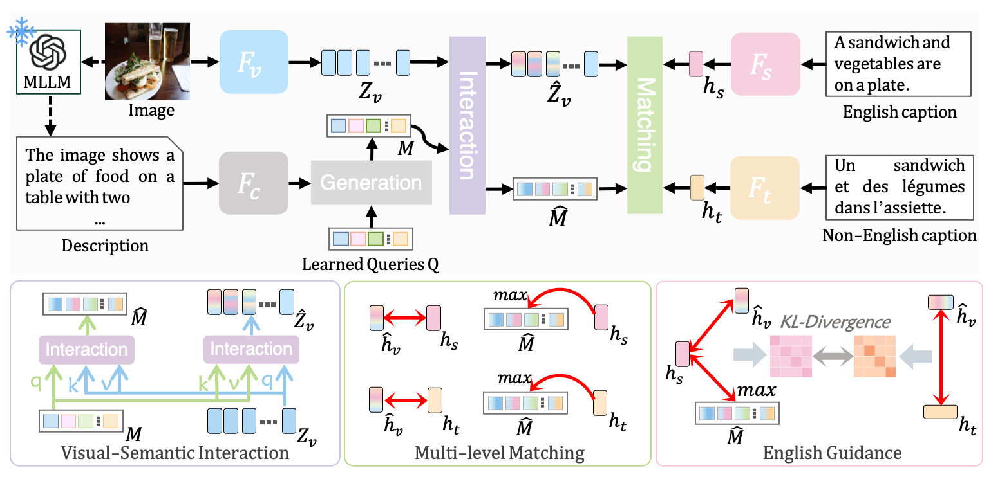

# Multimodal LLM Enhanced Cross-lingual Cross-modal Retrieval

source code of our paper [Multimodal LLM Enhanced Cross-lingual Cross-modal Retrieval](https://arxiv.org/pdf/2409.19961)



### Data

The training and inference data can be obtained from the [NRCCR](https://github.com/LiJiaBei-7/nrccr), and we use the [videochat2](https://github.com/OpenGVLab/Ask-Anything) to generate the image description.

### Training

```
cd LECCR
sh run_multi30k.sh
sh run_mscoco.sh
sh run_video.sh
```


The codes are modified from [NRCCR](https://github.com/LiJiaBei-7/nrccr) and [CCLM](https://github.com/zengyan-97/CCLM).

## Reference

If you find the package useful, please consider citing our paper:

```
@inproceedings{wang2024multimodal,
  title={Multimodal llm enhanced cross-lingual cross-modal retrieval},
  author={Wang, Yabing and Wang, Le and Zhou, Qiang and Wang, Zhibin and Li, Hao and Hua, Gang and Tang, Wei},
  booktitle={Proceedings of the 32nd ACM International Conference on Multimedia},
  pages={8296--8305},
  year={2024}
}
```


